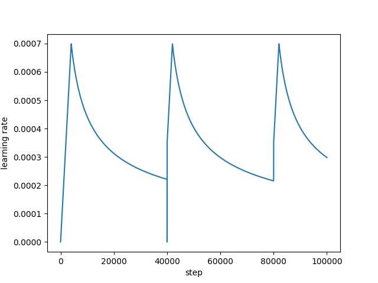
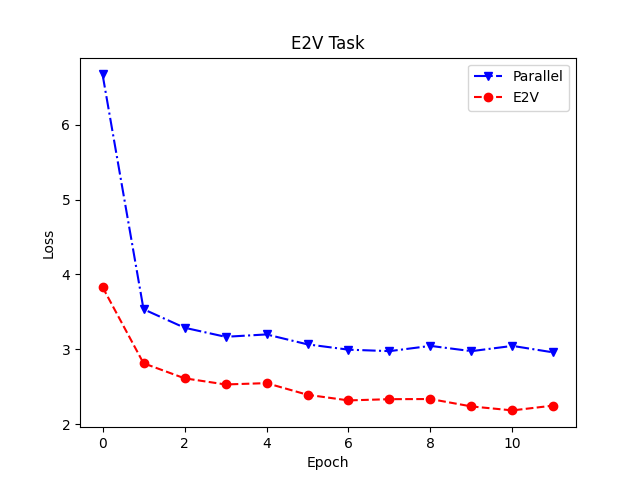
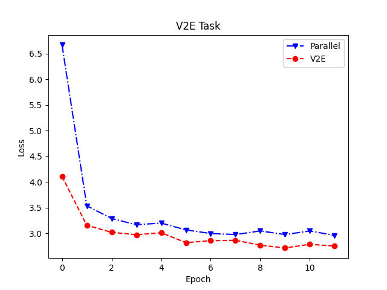

# Machine Translation using Transformer architecture
This repository contains code for constructing a translation model based on the Transformer architecture using PyTorch, focusing on translation between Vietnamese and English.
## Overview
The Transformer architecture has been highly successful in the field of machine translation and natural language processing in general. This sparked my curiosity about its inner workings. Therefore, I reimplemented this architecture using PyTorch for the task of English-to-Vietnamese and Vietnamese-to-English translation. Additionally, I made some modifications to the architecture to allow the model to handle both languages and reduce the number of parameters without significantly impacting the model's performance.
## Data
The dataset I used for this project was collected from [here](https://huggingface.co/datasets/harouzie/vi_en-translation). For convenience in the training process, the data is stored in a .json format as a list of dictionaries:
```
[
    {
        "id": "HAI_0",
        "E": "I heard that since Tom isn't feeling well he won't come to school today",
        "V": "tôi nghe nói rằng vì tom không khỏe nên hôm nay anh ấy sẽ không đến trường"
    },
    {
        "id": "HAI_1",
        "E": "The pharmacy is on Fresno Street",
        "V": "hiệu thuốc nằm trên đường fresno"
    },
    ...
]    
```
## Model
### Standard Architecture
The Transformer architecture is widely known, and you can refer to the paper [Attention Is All You Need](https://arxiv.org/pdf/1706.03762). Numerous code implementations of this architecture can be found on GitHub, for example, at [here](https://github.com/bangoc123/transformer).
### My Model
First, in the decoder, the word embedding matrix can be reused to map the output. See the following example:
```
class Decoder(nn.Module):
    def __init__(self, dec_voc_size, max_len, d_model, ffn_hidden, n_head, n_layers, drop_prob, device):
        super().__init__()
        self.emb = TransformerEmbedding(d_model=d_model,
                                        drop_prob=drop_prob,
                                        max_len=max_len,
                                        vocab_size=dec_voc_size,
                                        device=device)

        self.layers = nn.ModuleList([DecoderLayer(d_model=d_model,
                                                  ffn_hidden=ffn_hidden,
                                                  n_head=n_head,
                                                  drop_prob=drop_prob)
                                     for _ in range(n_layers)])

        self.linear = nn.Linear(d_model, dec_voc_size)

    def forward(self, trg, src, trg_mask, src_mask):
        trg = self.emb(trg)

        for layer in self.layers:
            trg = layer(trg, src, trg_mask, src_mask)

        # pass to LM head
        output = self.linear(trg)
        return output
```
Essentially, the `self.emb` component is a matrix of size `dec_voc_size` x `dmodel`, and `self.linear` is a matrix of size `dmodel` x `dec_voc_size`. Thus, instead of using two separate matrices, we can use a single matrix of size `dec_voc_size` x `dmodel`. When performing `self.linear`, we can simply reuse this matrix by transposing it.

Second, the decoder is essentially the encoder. The difference lies in the decoder's use of cross-attention between the input and output sentences. By removing cross-attention, it functions as an encoder. Thus, two decoders can be employed in the model—one for Vietnamese and one for English. Depending on the translation task, the input sentence will be passed through one of these decoders, which will act as the encoder. In this case, the encoder will skip the cross-attention mechanism

## Training
The models share the following hyperparameters: 
| d_model      | d_ff | head | layer | dropout | 
| ----------- | ----------- | ----------- | ----------- | ---------- |
| 128      | 256       | 8 | 2 | 0.1 |

The models were trained for 12 epochs with a batch size of 32, using the Adam optimizer and sparse cross entropy loss with the following learning rates:

 

 ## Main results
For convenience, I named the models based on their tasks. The model for Vietnamese-to-English translation is called V2E, the reverse is E2V, and the model capable of both tasks is named parallel.

|       | E2V | V2E | Parallel | 
| ----------- | ----------- | ----------- | ----------- |
| Total parameters      | 12,344,857    | 15,616,039 | 9,650,688 | 


For the English-to-Vietnamese translation task, the following results were obtained:

|       | E2V | Parallel | 
| ----------- | ----------- | ----------- |
| BLEU      | 0.6306 | 0.6328 | 
| GENLEN      | 16.6755 | 15.9806 |

|       | Accuracy_Train | Accuracy_Valid |  Accuracy_Test | 
| ----------- | ----------- | ----------- |--------------| 
| E2V      | 0.6044 | 0.7985 | 0.7984 |  
| Parallel      | 0.5309 | 0.7157 | 0.7148 | 




The results for the Vietnamese-to-English translation task are as follows:

|       | V2E | Parallel | 
| ----------- | ----------- | ----------- |
| BLEU      | 0.6499 | 0.6505 | 
| GENLEN      | 14.3740 | 13.9373 |

|       | Accuracy_Train | Accuracy_Valid |  Accuracy_Test | 
| ----------- | ----------- | ----------- |--------------| 
| V2E      | 0.5795 | 0.7406 | 0.7425 |  
| Parallel      | 0.5236 | 0.6810 | 0.6820 | 



## Conclusion
Based on the metrics above, it is evident that the architectural adjustments to the model are acceptable. The model's parameters were reduced by approximately 20-30% compared to models with the same tasks and hyperparameters. Although there is a slight disadvantage in terms of Accuracy, my architecture outperforms in BLEU score and has a lower GENLEN value. Due to resource limitations, the models were only trained for 12 epochs. With more training, their performance might converge more closely

## Inference Mode
For the inference process, you can proceed as follows:
```
def predict(self, encoder_input, decoder_input, is_train, max_length, end_token):
    print('=============Inference Progress================')
    print('----------------Begin--------------------')
    # Loading checkpoint
    if self.checkpoint_manager.latest_checkpoint:
        self.checkpoint.restore(self.checkpoint_manager.latest_checkpoint)
        print('Restored checkpoint manager !')
    
    for i in range(max_length):

        encoder_padding_mask, decoder_look_ahead_mask ,decoder_padding_mask = generate_mask(encoder_input, decoder_input)

        preds = self.model(encoder_input, decoder_input, is_train, encoder_padding_mask, decoder_look_ahead_mask, decoder_padding_mask)
        # print('---> preds', preds)

        preds = preds[:, -1:, :]  # (batch_size, 1, vocab_size)

        predicted_id = tf.argmax(preds, axis=-1)

        decoder_input = tf.concat([decoder_input, predicted_id], axis=-1)

        # return the result if the predicted_id is equal to the end token
        if predicted_id == end_token:
            break

    return decoder_input
```
With this approach, if the output sentence contains O(k) tokens, you will need to process O(k^2) tokens due to the recalculation of attention matrices. Additionally, the process only terminates when all sentences in the batch have predicted the `<end>` token, or when the maximum number of tokens has been generated. This makes the inference process time-consuming and resource-intensive.

Therefore, I implemented a custom inference method for the models. By caching the K and V matrices at each layer, the model only needs to process O(n) tokens. Additionally, sentences that have already ended with the `<end>` token are removed from the batch. The process concludes when there are no sentences left in the batch or when the maximum number of tokens has been generated. You can see in `MyTrans.py`for detail.


## Other thing
All models were trained on Kaggle using notebook `transformerparallel`, and after training, they were saved in the Kaggle output directory. The models can be found here [V2E](https://www.kaggle.com/models/hai3kk/v2e), [Parallel](https://www.kaggle.com/models/hai3kk/para) and [E2V](https://www.kaggle.com/models/hai3kk/e2v).

To perform inference, you can use the predict function or utilize `model.inference`. I recommend using the latter, even though it is slightly more complex.
```
import json
import torch
import utils
with open("vocab/vocabE1.json", "r", encoding='utf-8') as file:
    vocabE = json.load(file)  
with open("vocab/vocabV1.json", "r", encoding='utf-8') as file:
    vocabV = json.load(file)  
E_tokenizer = md.MyTokenizer(vocabE)
V_tokenizer = md.MyTokenizer(vocabV)
results = torch.load("checkpoint/bestmodel_E2v.pth", map_location=torch.device('cpu'))
model = MyTrans.Transformer(input_vocab_size= len(vocabE), output_vocab_size= len(vocabV), dmodel = 128, dembed = 128, d_ff = 256, head = 8, layer = 2, dropout = 0.1,eps = 1e-5)
model.load_state_dict(results['model'])
data = "tom won't be here tomorrow . i'm sure to tell you that"
tmp = utils.predict(model, data, E_tokenizer, V_tokenizer)
tmp1 = model.inference(E_tokenizer.encode(data).unsqueeze(0), 18, 300)
# Id token <end> is 18 with E2V and 16 with V2E  
# tmp is '<start> tom sẽ không ở đây vào ngày mai . tôi chắc chắn tôi chắc chắn rằng bạn rằng <end>'
# tmp1 is '<start> tom sẽ không ở đây vào ngày mai . tôi đảm bảo bạn . <end>'
```
